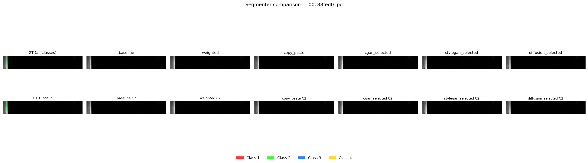
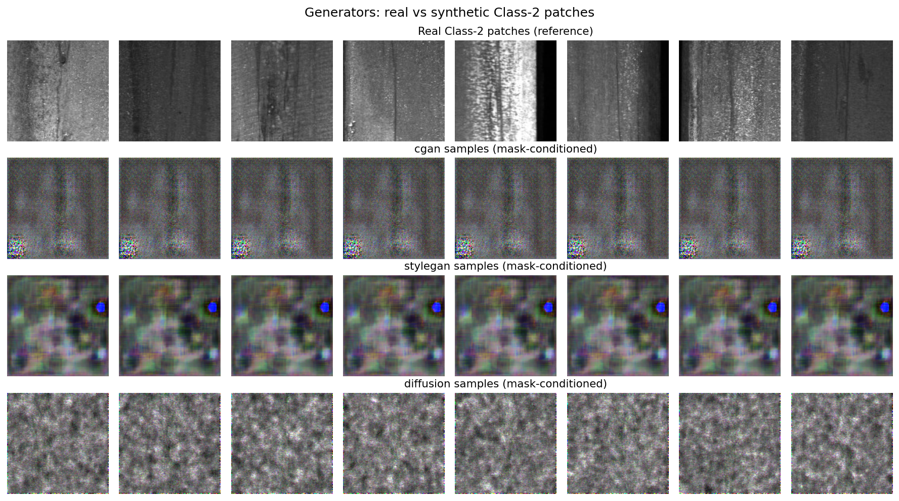
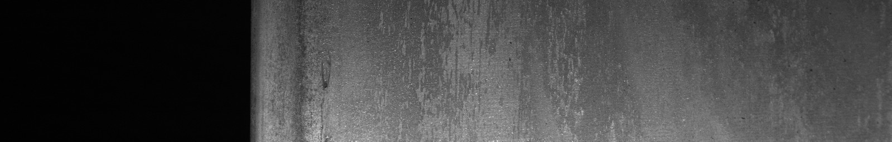

# Defect Detection (Severstal)

Rare-class steel defect work on the [Severstal Steel Defect Detection](https://www.kaggle.com/c/severstal-steel-defect-detection) dataset.

Two related experiments share the same data and rare-class focus (Class-2):

| Experiment | Task | Code | Question |
|------------|------|------|----------|
| **Classification** | multi-label CNN | `app/models/` | Do class weights / oversampling / cVAE image synth help rare-class F1? |
| **Segmentation** | U-Net + mask-aware gens + Dice selection | `src/rare_defect/` | Does mask-conditioned generation + selection improve rare-class Dice / FNR / F1? |

cVAE is used only for classification. Segmentation is the main write-up path.

---

## Who does what (roles)

The segmentation detector is always a **U-Net**. Generators / copy-paste / weights only change **how the training set is built**; test stays real images only.

| Component | Role | Type | Where |
|-----------|------|------|-------|
| **DefectCNN** | Multi-label image classifier (has defect class 1–4?) | **Classifier** | Classification (`app/models/`) |
| **U-Net** | Pixel segmentation — where is each defect? | **Segmenter / detector** | Segmentation (all arms) |
| **cVAE** | Conditional VAE — synthesize rare-class **images** for CNN training | **Generator** | Classification only |
| **cGAN** | Mask-conditioned patch GAN — synthesize Class-2 defect patches | **Generator** | Segmentation (`cgan_selected` / `*_dice`) |
| **StyleGAN** | Style-based mask-conditioned patch generator | **Generator** | Segmentation (`stylegan_selected` / `*_dice`) |
| **Diffusion** | Mask-conditioned denoising diffusion patch generator | **Generator** | Segmentation (`diffusion_selected` / `*_dice`) |
| **Copy-Paste** | Cut real Class-2 patches and paste onto other sheets (+ GT masks) | **Augmentation** (real pixels, not a learned generator) | Segmentation `copy_paste` |
| **Class weights** | Up-weight rare class in the loss | **Loss rebalancing** | Both (`weighted`) |
| **Oversampling** | Duplicate rare-class images in the loader | **Sampling rebalancing** | Classification only |
| **Top-k selection** | Score generator candidates with frozen U-Net rare Dice; keep best `num_selected` | **Static Dice filter** | Segmentation `*_selected` |
| **Dice selection (`*_dice`)** | Keep/reject candidates using val **Class-2 Dice** after a short U-Net finetune | **Dice-guided sample filter** | Segmentation (not run in 5-ep table below) |

### Segmentation experimental arms

| Arm | What changes vs plain U-Net |
|-----|-----------------------------|
| `baseline` | U-Net + light photo/geo aug only |
| `weighted` | Same U-Net; Class-2 boosted in the loss |
| `copy_paste` | Same U-Net; paste real rare patches during training |
| `cgan_selected` | Train cGAN → 500 candidates → top-k by Dice → mix into U-Net train |
| `stylegan_selected` | Same pipeline with StyleGAN |
| `diffusion_selected` | Same pipeline with Diffusion |
| `*_dice` | Same generators, but keep/reject guided by val Class-2 Dice (vs static top-k) |

```
cGAN / StyleGAN / Diffusion  -->  candidate synthetics
                |
         static top-k by Dice  (ablation: *_selected)
                |
         Dice selection  (*_dice)  --> keep/reject
                |
         score = val Class-2 Dice after short UNet finetune
                |
         final full UNet train; test stays real-only
```

---

## Results

### Classification (image-level F1)

Source: `results/results.csv`. Multi-label CNN on val.

| Method | Role | class_2 F1 | macro F1 |
|--------|------|------------|----------|
| baseline | Classifier, no rebalancing | 0.4225 | 0.4385 |
| weighted | Classifier + class weights | 0.3392 | 0.4239 |
| **oversampled** | Classifier + oversampling | **0.4545** | **0.5032** |
| vae_augmented | Classifier + cVAE synth images | 0.3492 | 0.3746 |
| vae_oversampled | cVAE synth + oversampling | 0.4409 | 0.4675 |

**Takeaway:** oversampling helped most on classification; naive cVAE augmentation alone hurt / did not beat oversampling.

### Segmentation (5-epoch quick run)

Protocol: **segmenter 5 epochs**, generators **5 epochs**, static top-k by Dice (Dice keep/reject arms not run yet). Frozen real test split only.

Sources: `results/seg_5ep_summary.csv`, `results/seg_5ep_f1.csv`, `runs/arm_*/test_metrics.json`.

#### Primary metrics (pixel Dice / cost)

| Arm | Role | mean Dice | **Class-2 Dice** | FNR | expected cost |
|-----|------|-----------|------------------|-----|---------------|
| baseline | Segmenter only | 0.282 | 0.003 | 0.052 | 1.156 |
| **weighted** | Segmenter + loss weights | 0.257 | **0.143** | 0.057 | 1.162 |
| copy_paste | Segmenter + real-patch paste | 0.233 | 0.098 | 0.072 | 1.249 |
| stylegan_selected | StyleGAN generator + top-k → U-Net | **0.295** | 0.062 | **0.017** | **0.795** |
| cgan_selected | cGAN generator + top-k → U-Net | 0.260 | 0.047 | 0.054 | 1.117 |
| diffusion_selected | Diffusion generator + top-k → U-Net | 0.254 | 0.006 | 0.035 | 0.955 |

Pixel F1 for a binary mask equals Dice (`pixel_f1` in the F1 CSV).

#### Image-level F1 (presence/absence, comparable to classification)

| Arm | class_2 F1 | macro F1 | class_2 pixel F1 (=Dice) |
|-----|------------|----------|--------------------------|
| **copy_paste** | **0.1475** | 0.3286 | 0.0977 |
| weighted | 0.0989 | 0.3056 | **0.1435** |
| stylegan_selected | 0.0642 | 0.3360 | 0.0618 |
| cgan_selected | 0.0626 | **0.3423** | 0.0469 |
| diffusion_selected | 0.0370 | 0.3238 | 0.0062 |
| baseline | 0.0244 | 0.3396 | 0.0034 |

**Takeaway (5-ep):**
- Best **rare pixel** score: **weighted** → checkpoint `runs/arm_weighted/best.pt`
- Best **rare image-level F1**: **copy_paste** → `runs/arm_copy_paste/best.pt`
- Best **cost / FNR** among generators: **StyleGAN**; cGAN middling; Diffusion ≈ baseline under this short budget
- Generators were under-trained (5 epochs on ~172 Class-2 patches); longer runs / `*_dice` may change the ranking

### Figures

Qualitative plots from the 5-epoch run live in `results/figures/`:

| File | What it shows |
|------|----------------|
| [`segmenters_compare.png`](results/figures/segmenters_compare.png) | Same Class-2 test sheet: GT vs each U-Net arm (all classes + Class-2 only) |
| [`segmenter_<arm>.png`](results/figures/) | Per-arm image / GT / prediction on 3 test samples |
| [`generators_compare.png`](results/figures/generators_compare.png) | Real Class-2 patches vs cGAN / StyleGAN / Diffusion samples |
| [`generator_<name>.png`](results/figures/) | Individual generator sample grids |





At 5 epochs the generators still look noisy / collapsed, which matches their weak Dice gains above.

### Saved models & metrics

Numbers above are also on disk under `results/` (CSV) and `runs/arm_*/test_metrics.json`.

Weights are written locally under `runs/` (gitignored — large `.pt` files):

| Path | Contents |
|------|----------|
| `runs/arm_<name>/best.pt` | Best U-Net for that arm (by val Class-2 Dice) |
| `runs/arm_<name>/last.pt` | Last-epoch U-Net |
| `runs/arm_<name>/test_metrics.json` | Test Dice / FNR / cost (+ F1 if computed) |
| `runs/generator_cgan_c2/cgan.pt` | Trained cGAN |
| `runs/generator_stylegan_c2/stylegan.pt` | Trained StyleGAN |
| `runs/generator_diffusion_c2/diffusion.pt` | Trained Diffusion |
| `app/models/*.pth` | Classification CNN / cVAE weights |

**Best segmentation model (Class-2 Dice):** `runs/arm_weighted/best.pt`

```bash
python scripts/evaluate.py --checkpoint runs/arm_weighted/best.pt
```

---

## Repository layout

What each top-level folder is for:

| Path | Purpose |
|------|---------|
| `app/` | Classification app package. `app/models/` holds DefectCNN, cVAE, train/eval scripts, and `.pth` weights. |
| `app/evaluation/`, `evaluate_all.py` | Unified evaluation pipeline: reruns all seven classification checkpoints on the committed val split with PR-AUC, cost-sensitivity analysis, and a reproducibility manifest. |
| `notebooks/` | One-off notebooks: build multi-label CSVs, class-imbalance plots, VAE-augmented splits. |
| `src/rare_defect/` | Segmentation library (importable package): datasets, U-Net / generators, losses, metrics, training loops. |
| `src/rare_defect/data/` | Load Severstal images/masks, RLE, splits, copy-paste / photo aug. |
| `src/rare_defect/models/` | Model definitions: `unet.py`, `cgan.py`, `stylegan.py`, `diffusion.py`. |
| `src/rare_defect/training/` | Train/eval loops for segmenter, generators, top-k / Dice sample selection. |
| `scripts/` | CLI entrypoints for segmentation: smoke test, prepare splits, train generators, run arms, evaluate. |
| `configs/` | YAML hyperparameters (`default.yaml`: epochs, batch size, Dice-selection knobs, paths). |
| `data/severstal/` | Classification train/val label CSVs (tracked). |
| `data/splits/` | Frozen Train/Val/Test image ids for segmentation (tracked). |
| `data/severstal-steel-defect-detection/` | Kaggle raw dump (`train.csv`, `train_images/`) — local only, not committed. |
| `results/` | Metric tables + `figures/` qualitative plots (tracked). `results.csv` (classification), `seg_5ep_*.csv` (segmentation), `unified/` (unified evaluation output). |
| `runs/` | Local experiment outputs: checkpoints + per-arm `test_metrics.json`. Ignored by git. |
| `logs/` | Optional run logs (local). |

```
defect-detection/
  app/models/              # Classification CNN + cVAE
  app/evaluation/          # Unified classifier evaluation (PR-AUC, cost sensitivity)
  evaluate_all.py          # Entry point for unified evaluation
  notebooks/               # Label / imbalance / VAE helpers
  src/rare_defect/         # Segmentation package
    data/ models/ training/
  scripts/                 # Segmentation CLIs
  configs/default.yaml
  data/
    severstal/             # Classification CSVs
    splits/                # Segmentation id splits
    severstal-steel-defect-detection/   # Kaggle images (local)
  results/                 # CSV scores + figures/ (tracked)
  runs/                    # best.pt / generators (local, gitignored)
```

## Data setup

Put the Kaggle extract at `data/severstal-steel-defect-detection/` with:

```
train.csv
train_images/
test_images/          # unused for metrics
sample_submission.csv
```

If you still have it under the course `final_project/` folder, a Windows junction works:

```powershell
cmd /c mklink /J data\severstal-steel-defect-detection ..\final_project\severstal-steel-defect-detection
```

## Install

```bash
cd defect-detection
uv sync
# or: pip install -e .
```

Use a CUDA build of PyTorch when available (`device: cuda` in `configs/default.yaml`).

## Running the API

Build and run the Docker container:

    docker build -t defect-api .
    docker run -p 8000:8000 -e ANTHROPIC_API_KEY=your_key_here defect-api

The `ANTHROPIC_API_KEY` is optional — if omitted or if the LLM call fails, the API falls back to a rule-based inspection report instead of an LLM-generated one, so the container still runs and returns complete results without it.

Query the running API:

    curl -X POST http://localhost:8000/predict -F "file=@path/to/image.jpg"

Returns per-class defect probabilities, segmentation location/area (when available), and a plain-language inspection report.

### Example

Input: `002fc4e19.jpg` from the labelled Kaggle set (ground truth: Class 1 + Class 2, both present).



Response from `POST /predict`, `claude-sonnet-5` (real API call, not the fallback template):

```json
{
  "filename": "002fc4e19.jpg",
  "predictions": [
    { "defect_class": "class_1", "probability": 0.310, "detected": false },
    { "defect_class": "class_2", "probability": 0.565, "detected": true },
    { "defect_class": "class_3", "probability": 0.139, "detected": false },
    { "defect_class": "class_4", "probability": 0.019, "detected": false }
  ],
  "segmentation": {
    "available": true,
    "location": "bottom",
    "defect_area_percent": 0.458
  },
  "inspection_report": "Sheet 002fc4e19.jpg shows a detected class_2 defect with a probability of 0.565. Segmentation data indicates the defect is located at the bottom of the sheet, covering approximately 0.5% of its surface area. Given the moderate probability, additional manual inspection is recommended before further action."
}
```

The classifier correctly flags the Class-2 defect the report is built around (0.565); it misses the co-occurring Class-1 defect also present in this image's ground truth (0.310, below the 0.5 threshold) — a real limitation, not hidden here.

## Classification

From `app/models/`:

```bash
python train_baseline.py
python train_weighted.py
python train_oversampled.py
python train_cvae.py
python train_vae_augmented.py
python train_vae_oversampled.py

python evaluate_baseline.py
# … matching evaluate_*.py scripts
```

Notebooks under `notebooks/` build the multi-label CSVs and VAE-augmented splits.

## Unified classifier evaluation

`evaluate_all.py` reruns every completed DefectCNN classifier on the one committed validation split. It does not retrain or modify any model. The seven required methods are: `baseline`, `weighted`, `oversampled`, `vae_augmented`, `vae_oversampled`, `gan_oversampled`, and `rl_oversampled`.

### Prerequisite: labelled validation images

The committed `data/severstal/val_split.csv` was built from Kaggle's labelled `train_images` files. **Do not use `test_images`:** Kaggle supplies no labels for them, so precision, recall, PR-AUC, and false-negative cost cannot be calculated. Authenticate Kaggle on the machine first (for example with a Kaggle API token), then download the competition files:

```bash
uv run --with kagglehub python - <<'PY'
import kagglehub
print(kagglehub.competition_download('severstal-steel-defect-detection'))
PY
```

Pass the downloaded directory's `train_images` subdirectory to the command below. Alternatively, place or symlink it at `data/severstal/train_images`.

### Exact evaluation command

```bash
uv run python evaluate_all.py \
  --image-dir /absolute/path/from/kaggle/train_images \
  --threshold 0.5 \
  --fn-cost 10 --fp-cost 1 \
  --fn-fp-ratios 1,2,5,10,20 \
  --output-dir results/unified
```

The default threshold-dependent metrics use the same historical rule as the old scripts: `sigmoid(logit) > 0.5`. This makes it possible to compare the new precision, recall and F1 values against `results/results.csv`. A discrepancy larger than the configured rounding tolerance makes the command exit non-zero and is recorded in `results/unified/legacy_comparison.csv`.

### Outputs

- `metrics.csv`: every per-class, macro-average, and total metric row; it includes precision, recall, F1, average precision, PR-AUC, FNR, TP, FP, TN, FN, and the configured linear cost.
- `predictions.csv.gz`: gzip-compressed, auditable rows per method, image, and class with `y_true`, sigmoid `y_score`, `y_pred`, and threshold. Read it directly with `pandas.read_csv("predictions.csv.gz")`, or regenerate it with the evaluation command above.
- `legacy_comparison.csv`: the old and rerun threshold-0.5 metrics with deltas.
- `cost_sensitivity.csv` and `figures/cost_sensitivity.png`: explicitly labelled FN:FP scenario assumptions. For each ratio, FP cost is held at `--fp-cost` and FN cost is `ratio * FP cost`.
- `figures/model_comparison_macro_metrics.png` and one `figures/precision_recall_class_*.png` image per class.
- `run_manifest.json`: command, methods, class ordering, input hashes, and generated artifact list for reproducibility.

### Focused tests

```bash
uv run python -m unittest discover -s tests -v
```

## Segmentation + generative selection

```bash
python scripts/smoke_test.py
python scripts/prepare_splits.py   # skip if data/splits/ already present

python scripts/run_experiment.py --arm baseline
python scripts/run_experiment.py --arm weighted
python scripts/run_experiment.py --arm copy_paste

python scripts/train_generator.py --model cgan
python scripts/train_generator.py --model stylegan
python scripts/train_generator.py --model diffusion

# Static top-k by Dice
python scripts/run_experiment.py --arm cgan_selected
python scripts/run_experiment.py --arm stylegan_selected
python scripts/run_experiment.py --arm diffusion_selected

# Dice keep/reject selection (needs arm_baseline/best.pt if available)
# CLI still uses *_rl arm names; treat them as Dice selection.
python scripts/run_experiment.py --arm cgan_rl
python scripts/run_experiment.py --arm stylegan_rl
python scripts/run_experiment.py --arm diffusion_rl

python scripts/evaluate.py --checkpoint runs/arm_weighted/best.pt
```

Quick 5-epoch compare:

```bash
python scripts/run_experiment.py --arm baseline --epochs 5
# … same --epochs 5 for other arms; generators: --epochs 5
```

Primary segmentation metrics: mean Dice, Class-2 Dice, FNR, expected cost (`FN ≫ FP`), plus image-level F1 for comparison with classification. Synthetics never enter the final test set.

Dice-selection knobs live under `rl:` in `configs/default.yaml` (`episodes`, `finetune_epochs`, `min_keep` / `max_keep`, `reward_real_samples` — score is Class-2 Dice).